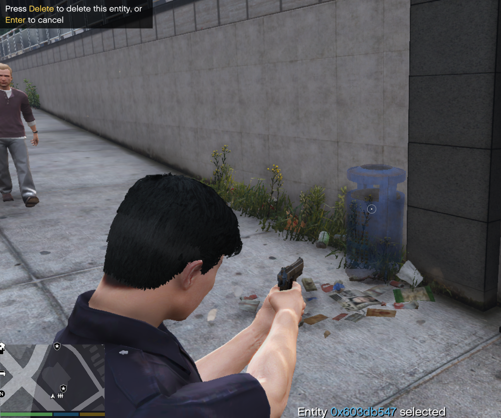

# DeleteThat_RPHPlugin

## Usage
- Aim a weapon at an entity, then press `Delete`.  
  The selected entity should become partially transparent.
- Then press `Delete` a second time to confirm deletion, or press `Enter` to cancel.

